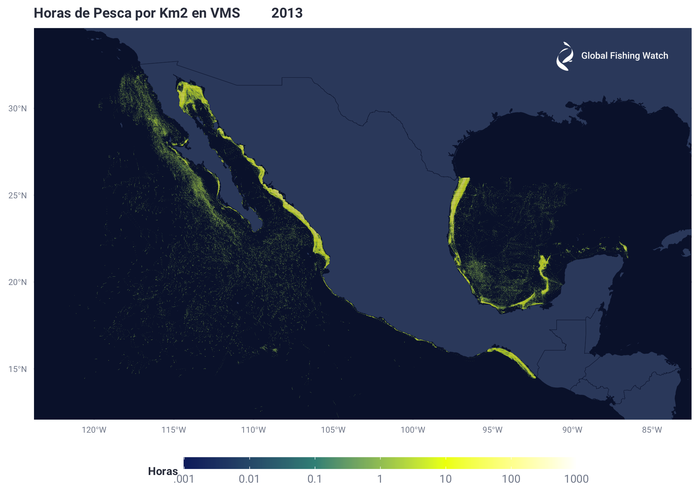
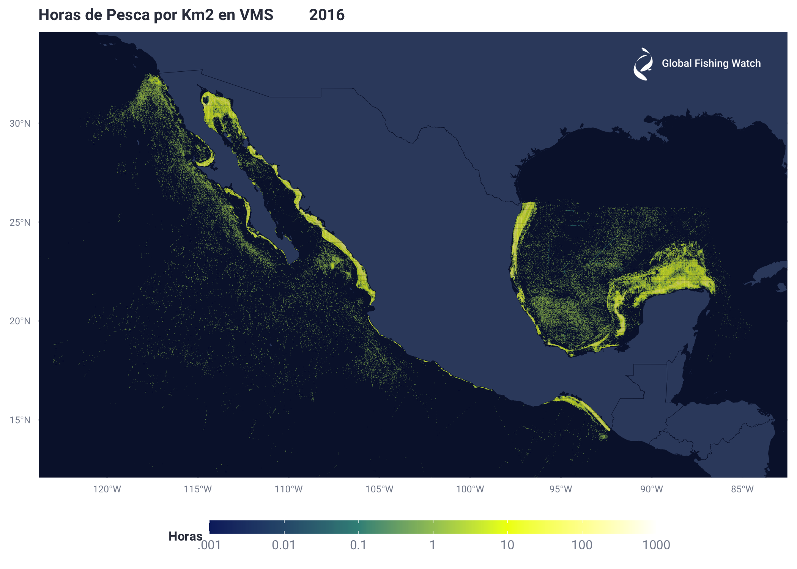
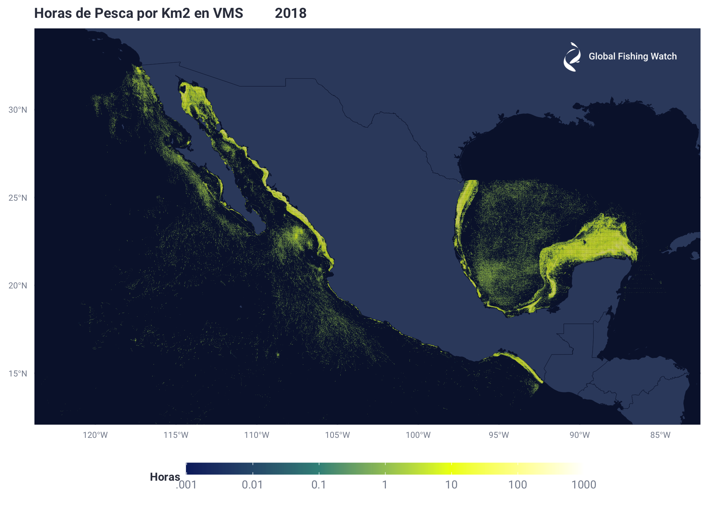
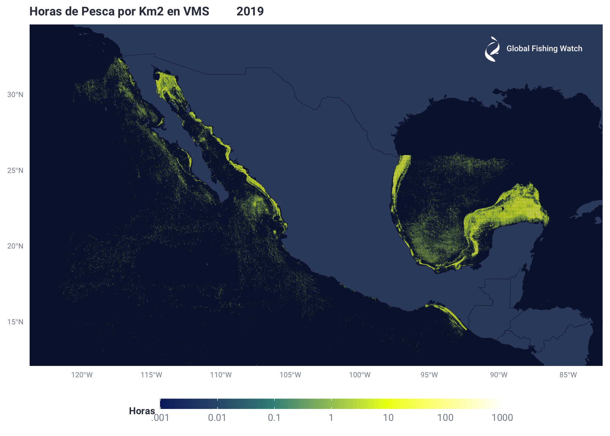
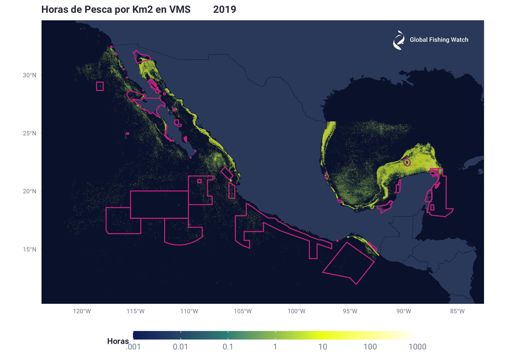

Esfuerzo Pesquero Datos VMS México
================
Esteban Arenas
7/14/2020

Extract fishing hours (Hrs/Km2) for all of the VMS Mexico data per year
by 100th Lat and Lon bins

``` r
query_string <- glue::glue('
CREATE TEMP FUNCTION hours_diff_abs(timestamp1 TIMESTAMP,
timestamp2 TIMESTAMP) AS (
#
# Return the absolute value of the diff between the two timestamps in hours with microsecond precision
# If either parameter is null, return null
#
ABS(TIMESTAMP_DIFF(timestamp1,
    timestamp2,
    microsecond) / 3600000000.0) );

WITH 

pos AS (
select
  ssvid,
  msgid,
  seg_id,
  timestamp,
  # Change this to month or year if you want to aggregate differently
  EXTRACT(YEAR from timestamp) as year,
  LAG(timestamp, 1) OVER (PARTITION BY seg_id  ORDER BY timestamp) prev_timestamp,
  floor(lat * 100) as lat_bin,
  floor(lon * 100) as lon_bin,
  nnet_score
from `pipe_mexico_production_v20190912.messages_scored_*`
),

pos_hours AS (
SELECT
*,
IFNULL (hours_diff_abs (timestamp, prev_timestamp), 0) hours
FROM pos
),

# Summarize fishing
fishing AS (
SELECT
year,
lat_bin / 100 as lat_bin,
lon_bin / 100 as lon_bin,
SUM(IF(nnet_score > 0.5, hours, 0)) as fishing_hours
FROM pos_hours
GROUP BY year, lat_bin, lon_bin
)

# Return
#Transform to hours/km2
SELECT *, 
fishing_hours/(COS(udfs_v20200701.radians(lat_bin)) * (111/100)  * (111/100) ) AS fishing_hours_sq_km,
FROM fishing')
Mx_VMS_Esfuerzo_Pesquero100 <- DBI::dbGetQuery(con, query_string)
Mx_VMS_Esfuerzo_Pesquero100$Log_fishing_hours_sq_km <- log10(Mx_VMS_Esfuerzo_Pesquero100$fishing_hours_sq_km)
# write.csv(Mx_VMS_Esfuerzo_Pesquero100, file = "Mx_VMS_Esfuerzo_Pesquero100.csv")
```

Create individual DB for all years and then create maps using those
tables

``` r
#Create new DB for each year with 100 lat lon resolution. 2012 seems to be in a separate table that will require a different process to extract

Mx_VMS_Esfuerzo_Pesquero100 <- read.csv ("/Users/Esteban/Documents/Jobs/GFW/Proyectos/Mexico/CN_Mexico/Datos/VMS/Mx_VMS_Esfuerzo_Pesquero100.csv", header = TRUE)

Y2013_100 <- Mx_VMS_Esfuerzo_Pesquero100[Mx_VMS_Esfuerzo_Pesquero100$year == 2013,]
Y2014_100 <- Mx_VMS_Esfuerzo_Pesquero100[Mx_VMS_Esfuerzo_Pesquero100$year == 2014,]
Y2015_100 <- Mx_VMS_Esfuerzo_Pesquero100[Mx_VMS_Esfuerzo_Pesquero100$year == 2015,]
Y2016_100 <- Mx_VMS_Esfuerzo_Pesquero100[Mx_VMS_Esfuerzo_Pesquero100$year == 2016,]
Y2017_100 <- Mx_VMS_Esfuerzo_Pesquero100[Mx_VMS_Esfuerzo_Pesquero100$year == 2017,]
Y2018_100 <- Mx_VMS_Esfuerzo_Pesquero100[Mx_VMS_Esfuerzo_Pesquero100$year == 2018,]
Y2019_100 <- Mx_VMS_Esfuerzo_Pesquero100[Mx_VMS_Esfuerzo_Pesquero100$year == 2019,]

# write.csv(Temp, file = "Y2013_100.csv")
```

``` r
###Mapa
#Import poligons of interest to be displayed on maps
#Pisagua
Zonas_Fedecoop <- st_read("/Users/Esteban/Documents/Jobs/GFW/Proyectos/Mexico/CN_Mexico/Datos/AMP/Zonas_Fedecoop.shp")
AMP_MX <- st_read("/Users/Esteban/Documents/Jobs/GFW/Proyectos/Mexico/CN_Mexico/Datos/AMP/AMP_MX.shp")
```

``` r
Tmp <- copy(Y2013_100[Y2013_100$fishing_hours_sq_km > 0,])

# GFW logo
gfw_logo <- png::readPNG("/Users/Esteban/Documents/Jobs/GFW/General/Logo/GFW_logo_primary_White.png")
gfw_logo_rast <- grid::rasterGrob(gfw_logo, interpolate = T)

#Map
land_sf <- rnaturalearth::ne_countries(scale = 10, returnclass = 'sf')
Mx_2013 <- ggplot() + 
  geom_sf(data = land_sf,
            fill = fishwatchr::gfw_palettes$map_country_dark[1],
            color = fishwatchr::gfw_palettes$map_country_dark[2],
          size=.1) +
    scale_fill_gradientn(colours = fishwatchr::gfw_palettes$map_effort_dark,
                         breaks = c(-3,-2,-1,0,1,2,3), labels = c('.001','0.01', '0.1', '1', '10', '100', '1000'),
                         limits = c(-3,3), oob=scales::squish)+
  fishwatchr::theme_gfw_map(theme = 'dark')+
  geom_tile(data = Tmp, aes(x = lon_bin, y = lat_bin, fill = Log_fishing_hours_sq_km), alpha = 0.5)+
  labs(fill = "Horas", title = "Horas de Pesca por Km2 en VMS         2013")+
  coord_sf(xlim = c(-121.9, -84.4), ylim = c(13.1, 33.6))+

  #Add GFW logo
  annotation_custom(gfw_logo_rast,
                      ymin = 32,
                      ymax = 34,
                      xmin = -91,
                      xmax = -84)
Mx_2013
```

<!-- -->

``` r
# ggsave("Mx_2013.png", dpi=300)
```

``` r
Tmp <- copy(Y2014_100[Y2014_100$fishing_hours_sq_km > 0,])

#Map
Mx_2014 <- ggplot() + 
  geom_sf(data = land_sf,
            fill = fishwatchr::gfw_palettes$map_country_dark[1],
            color = fishwatchr::gfw_palettes$map_country_dark[2],
          size=.1) +
    scale_fill_gradientn(colours = fishwatchr::gfw_palettes$map_effort_dark,
                         breaks = c(-3,-2,-1,0,1,2,3), labels = c('.001','0.01', '0.1', '1', '10', '100', '1000'),
                         limits = c(-3,3), oob=scales::squish)+
  fishwatchr::theme_gfw_map(theme = 'dark')+
  geom_tile(data = Tmp, aes(x = lon_bin, y = lat_bin, fill = Log_fishing_hours_sq_km), alpha = 0.5)+
  labs(fill = "Horas", title = "Horas de Pesca por Km2 en VMS         2014")+
  coord_sf(xlim = c(-121.9, -84.4), ylim = c(13.1, 33.6))+

  #Add GFW logo
  annotation_custom(gfw_logo_rast,
                      ymin = 32,
                      ymax = 34,
                      xmin = -91,
                      xmax = -84)
Mx_2014
```

<!-- -->

``` r
# ggsave("Mx_2014.png", dpi=300)
```

``` r
Tmp <- copy(Y2015_100[Y2015_100$fishing_hours_sq_km > 0,])

#Map
Mx_2015 <- ggplot() + 
  geom_sf(data = land_sf,
            fill = fishwatchr::gfw_palettes$map_country_dark[1],
            color = fishwatchr::gfw_palettes$map_country_dark[2],
          size=.1) +
    scale_fill_gradientn(colours = fishwatchr::gfw_palettes$map_effort_dark,
                         breaks = c(-3,-2,-1,0,1,2,3), labels = c('.001','0.01', '0.1', '1', '10', '100', '1000'),
                         limits = c(-3,3), oob=scales::squish)+
  fishwatchr::theme_gfw_map(theme = 'dark')+
  geom_tile(data = Tmp, aes(x = lon_bin, y = lat_bin, fill = Log_fishing_hours_sq_km), alpha = 0.5)+
  labs(fill = "Horas", title = "Horas de Pesca por Km2 en VMS         2015")+
  coord_sf(xlim = c(-121.9, -84.4), ylim = c(13.1, 33.6))+

  #Add GFW logo
  annotation_custom(gfw_logo_rast,
                      ymin = 32,
                      ymax = 34,
                      xmin = -91,
                      xmax = -84)
Mx_2015
```

<!-- -->

``` r
# ggsave("Mx_2015.png", dpi=300)
```

``` r
Tmp <- copy(Y2016_100[Y2016_100$fishing_hours_sq_km > 0,])

#Map
Mx_2016 <- ggplot() + 
  geom_sf(data = land_sf,
            fill = fishwatchr::gfw_palettes$map_country_dark[1],
            color = fishwatchr::gfw_palettes$map_country_dark[2],
          size=.1) +
    scale_fill_gradientn(colours = fishwatchr::gfw_palettes$map_effort_dark,
                         breaks = c(-3,-2,-1,0,1,2,3), labels = c('.001','0.01', '0.1', '1', '10', '100', '1000'),
                         limits = c(-3,3), oob=scales::squish)+
  fishwatchr::theme_gfw_map(theme = 'dark')+
  geom_tile(data = Tmp, aes(x = lon_bin, y = lat_bin, fill = Log_fishing_hours_sq_km), alpha = 0.5)+
  labs(fill = "Horas", title = "Horas de Pesca por Km2 en VMS         2016")+
  coord_sf(xlim = c(-121.9, -84.4), ylim = c(13.1, 33.6))+

  #Add GFW logo
  annotation_custom(gfw_logo_rast,
                      ymin = 32,
                      ymax = 34,
                      xmin = -91,
                      xmax = -84)
Mx_2016
```

<!-- -->

``` r
# ggsave("Mx_2016.png", dpi=300)
```

``` r
Tmp <- copy(Y2017_100[Y2017_100$fishing_hours_sq_km > 0,])

#Map
Mx_2017 <- ggplot() + 
  geom_sf(data = land_sf,
            fill = fishwatchr::gfw_palettes$map_country_dark[1],
            color = fishwatchr::gfw_palettes$map_country_dark[2],
          size=.1) +
    scale_fill_gradientn(colours = fishwatchr::gfw_palettes$map_effort_dark,
                         breaks = c(-3,-2,-1,0,1,2,3), labels = c('.001','0.01', '0.1', '1', '10', '100', '1000'),
                         limits = c(-3,3), oob=scales::squish)+
  fishwatchr::theme_gfw_map(theme = 'dark')+
  geom_tile(data = Tmp, aes(x = lon_bin, y = lat_bin, fill = Log_fishing_hours_sq_km), alpha = 0.5)+
  labs(fill = "Horas", title = "Horas de Pesca por Km2 en VMS         2017")+
  coord_sf(xlim = c(-121.9, -84.4), ylim = c(13.1, 33.6))+

  #Add GFW logo
  annotation_custom(gfw_logo_rast,
                      ymin = 32,
                      ymax = 34,
                      xmin = -91,
                      xmax = -84)
Mx_2017
```

<!-- -->

``` r
# ggsave("Mx_2017.png", dpi=300)
```

``` r
Tmp <- copy(Y2018_100[Y2018_100$fishing_hours_sq_km > 0,])

#Map
Mx_2018 <- ggplot() + 
  geom_sf(data = land_sf,
            fill = fishwatchr::gfw_palettes$map_country_dark[1],
            color = fishwatchr::gfw_palettes$map_country_dark[2],
          size=.1) +
    scale_fill_gradientn(colours = fishwatchr::gfw_palettes$map_effort_dark,
                         breaks = c(-3,-2,-1,0,1,2,3), labels = c('.001','0.01', '0.1', '1', '10', '100', '1000'),
                         limits = c(-3,3), oob=scales::squish)+
  fishwatchr::theme_gfw_map(theme = 'dark')+
  geom_tile(data = Tmp, aes(x = lon_bin, y = lat_bin, fill = Log_fishing_hours_sq_km), alpha = 0.5)+
  labs(fill = "Horas", title = "Horas de Pesca por Km2 en VMS         2018")+
  coord_sf(xlim = c(-121.9, -84.4), ylim = c(13.1, 33.6))+

  #Add GFW logo
  annotation_custom(gfw_logo_rast,
                      ymin = 32,
                      ymax = 34,
                      xmin = -91,
                      xmax = -84)
Mx_2018
```

<!-- -->

``` r
# ggsave("Mx_2018.png", dpi=300)
```

``` r
Tmp <- copy(Y2019_100[Y2019_100$fishing_hours_sq_km > 0,])

#Map
Mx_2019 <- ggplot() + 
  geom_sf(data = land_sf,
            fill = fishwatchr::gfw_palettes$map_country_dark[1],
            color = fishwatchr::gfw_palettes$map_country_dark[2],
          size=.1) +
    scale_fill_gradientn(colours = fishwatchr::gfw_palettes$map_effort_dark,
                         breaks = c(-3,-2,-1,0,1,2,3), labels = c('.001','0.01', '0.1', '1', '10', '100', '1000'),
                         limits = c(-3,3), oob=scales::squish)+
  fishwatchr::theme_gfw_map(theme = 'dark')+
  geom_tile(data = Tmp, aes(x = lon_bin, y = lat_bin, fill = Log_fishing_hours_sq_km), alpha = 0.5)+
  labs(fill = "Horas", title = "Horas de Pesca por Km2 en VMS         2019")+
  coord_sf(xlim = c(-121.9, -84.4), ylim = c(13.1, 33.6))+

  #Add GFW logo
  annotation_custom(gfw_logo_rast,
                      ymin = 32,
                      ymax = 34,
                      xmin = -91,
                      xmax = -84)
Mx_2019
```

<!-- -->

``` r
# ggsave("Mx_2019.png", dpi=300)
```

``` r
#Map
Mx_2019_AMP <- ggplot() + 
  geom_sf(data = land_sf,
            fill = fishwatchr::gfw_palettes$map_country_dark[1],
            color = fishwatchr::gfw_palettes$map_country_dark[2],
          size=.1) +
    scale_fill_gradientn(colours = fishwatchr::gfw_palettes$map_effort_dark,
                         breaks = c(-3,-2,-1,0,1,2,3), labels = c('.001','0.01', '0.1', '1', '10', '100', '1000'),
                         limits = c(-3,3), oob=scales::squish)+
  fishwatchr::theme_gfw_map(theme = 'dark')+
  geom_tile(data = Tmp, aes(x = lon_bin, y = lat_bin, fill = Log_fishing_hours_sq_km), alpha = 0.5)+
  labs(fill = "Horas", title = "Horas de Pesca por Km2 en VMS         2019")+
  geom_sf(data=AMP_MX,fill=NA, color="#CC3A8E")+
  coord_sf(xlim = c(-121.9, -84.4), ylim = c(11.4, 33.6))+

  #Add GFW logo
  annotation_custom(gfw_logo_rast,
                      ymin = 32,
                      ymax = 34,
                      xmin = -91,
                      xmax = -84)
Mx_2019_AMP
```

<!-- -->

``` r
# ggsave("Mx_2019_AMP.png", dpi=300)
```

``` r
#GIF from the images of the maps
png_files <- list.files("/Users/Esteban/Documents/Jobs/GFW/Proyectos/Mexico/CN_Mexico/Datos/VMS/EP_Mx_Mapas/GIF",
                        pattern = ".*png$", full.names = TRUE)
gifski(png_files, gif_file = "Mx_EP_2013_2019.gif", width = 2100, height = 2100, delay = 1)
```
