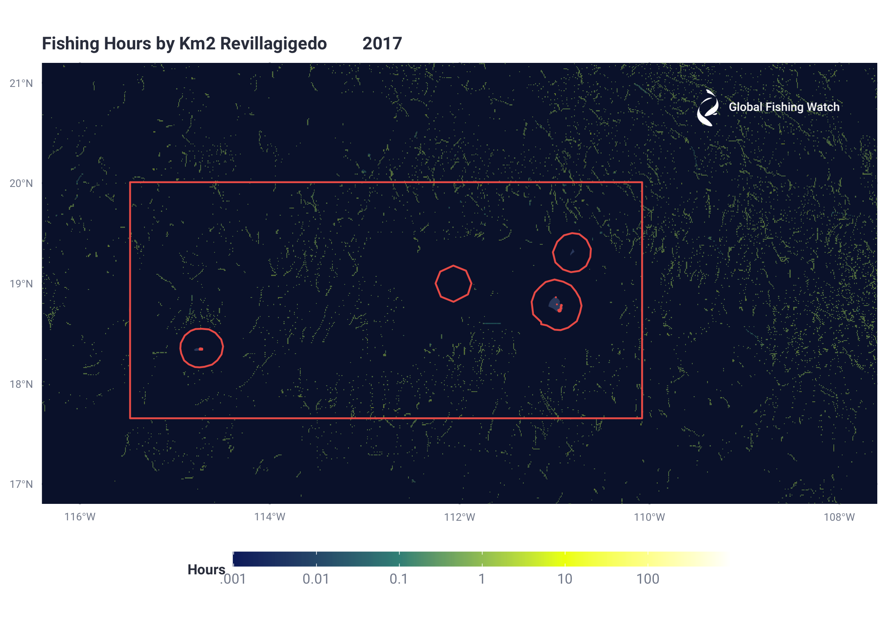
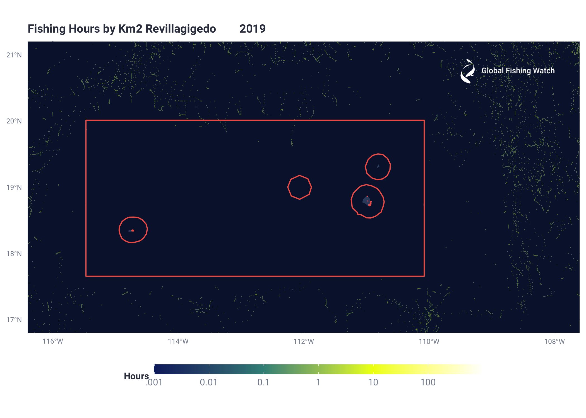

Revillagigedo
================
Esteban Arenas
7/21/2020

Extract fishing hours (Hrs/Km2) from Revillagigedo per year by 100th Lat
and Lon bins for the VMS Mexico data

``` r
query_string <- glue::glue('
CREATE TEMP FUNCTION hours_diff_abs(timestamp1 TIMESTAMP,
timestamp2 TIMESTAMP) AS (
#
# Return the absolute value of the diff between the two timestamps in hours with microsecond precision
# If either parameter is null, return null
#
ABS(TIMESTAMP_DIFF(timestamp1,
    timestamp2,
    microsecond) / 3600000000.0) );

WITH 
  aoi AS (
  SELECT
    ST_GEOGFROMTEXT("MultiPolygon (((-115.47141456499991818 20.00863075300009086, -110.07809257499991418 20.00863075300009086, -110.07809257499991418 17.65523338300005207, -115.47141456599990761 17.65523338300005207, -115.47141456499991818 20.00863075300009086)))") AS polygon ),

#Extract only lat lon within Revillagigedo polygon
revilla AS (
select *,
FROM `pipe_mexico_production_v20190912.messages_scored_*`
WHERE
IF (ST_CONTAINS((
SELECT
  polygon
FROM aoi),
ST_GEOGPOINT(lon,lat)),TRUE,FALSE)
),

pos AS (
select
  ssvid,
  msgid,
  seg_id,
  timestamp,
  # Change this to month or year if you want to aggregate differently
  EXTRACT(YEAR from timestamp) as year,
  LAG(timestamp, 1) OVER (PARTITION BY seg_id  ORDER BY timestamp) prev_timestamp,
  floor(lat * 100) as lat_bin,
  floor(lon * 100) as lon_bin,
  nnet_score
from revilla
),

pos_hours AS (
SELECT
*,
IFNULL (hours_diff_abs (timestamp, prev_timestamp), 0) hours
FROM pos
),

# Summarize fishing
fishing AS (
SELECT
year,
lat_bin / 100 as lat_bin,
lon_bin / 100 as lon_bin,
SUM(IF(nnet_score > 0.5, hours, 0)) as fishing_hours
FROM pos_hours
GROUP BY year, lat_bin, lon_bin
)

# Return
#Transform to hours/km2
SELECT *, 
fishing_hours/(COS(udfs_v20200701.radians(lat_bin)) * (111/100)  * (111/100) ) AS fishing_hours_sq_km,
FROM fishing
')
Revilla_VMS_Esfuerzo_Pesquero100 <- DBI::dbGetQuery(con, query_string)
Revilla_VMS_Esfuerzo_Pesquero100$Log_fishing_hours_sq_km <- log10(Revilla_VMS_Esfuerzo_Pesquero100$fishing_hours_sq_km)
# write.csv(Revilla_VMS_Esfuerzo_Pesquero100, file = "Revilla_VMS_Esfuerzo_Pesquero100.csv")
```

Create individual DB two year prior and post establishment of
Revillagigedo (2017) and then create tables and maps of fishing effort
prior to and post its establishment

``` r
#Create new DB for each year with 100 lat lon resolution. Mx_VMS_Esfuerzo_Pesquero100 was created previously as the fishing effort for all of Mexico

Revilla_VMS_Esfuerzo_Pesquero100 <- read.csv ("/Users/Esteban/Documents/Jobs/GFW/Proyectos/Mexico/CN_Mexico/Datos/Revillagigedo/Revilla_VMS_Esfuerzo_Pesquero100.csv", header = TRUE)

Mx_VMS_Esfuerzo_Pesquero100 <- read.csv ("/Users/Esteban/Documents/Jobs/GFW/Proyectos/Mexico/CN_Mexico/Datos/VMS/Mx_VMS_Esfuerzo_Pesquero100.csv", header = TRUE)
Y2015_100 <- Mx_VMS_Esfuerzo_Pesquero100[Mx_VMS_Esfuerzo_Pesquero100$year == 2015,]
Y2016_100 <- Mx_VMS_Esfuerzo_Pesquero100[Mx_VMS_Esfuerzo_Pesquero100$year == 2016,]
Y2017_100 <- Mx_VMS_Esfuerzo_Pesquero100[Mx_VMS_Esfuerzo_Pesquero100$year == 2017,]
Y2018_100 <- Mx_VMS_Esfuerzo_Pesquero100[Mx_VMS_Esfuerzo_Pesquero100$year == 2018,]
Y2019_100 <- Mx_VMS_Esfuerzo_Pesquero100[Mx_VMS_Esfuerzo_Pesquero100$year == 2019,]

# write.csv(RevY2015_100, file = "RevY2015_100.csv")
```

``` r
###Mapa
#Import poligons of interest to be displayed on maps
#Pisagua
RevillagigedoGJSON <- st_read("/Users/Esteban/Documents/Jobs/GFW/Proyectos/Mexico/CN_Mexico/Datos/Revillagigedo/Revillagigedo_Mexico.geojson")
```

``` r
Tmp <- copy(Y2015_100[Y2015_100$fishing_hours_sq_km > 0,])

# GFW logo
gfw_logo <- png::readPNG("/Users/Esteban/Documents/Jobs/GFW/General/Logo/GFW_logo_primary_White.png")
gfw_logo_rast <- grid::rasterGrob(gfw_logo, interpolate = T)

#Map
land_sf <- rnaturalearth::ne_countries(scale = 10, returnclass = 'sf')
Revillagigedo_2015 <- ggplot() + 
  geom_sf(data = land_sf,
            fill = fishwatchr::gfw_palettes$map_country_dark[1],
            color = fishwatchr::gfw_palettes$map_country_dark[2],
          size=.1) +
    scale_fill_gradientn(colours = fishwatchr::gfw_palettes$map_effort_dark,
                         breaks = c(-3,-2,-1,0,1,2), labels = c('.001','0.01', '0.1', '1', '10', '100'),
                         limits = c(-3,3), oob=scales::squish)+
  fishwatchr::theme_gfw_map(theme = 'dark')+
  geom_tile(data = Tmp, aes(x = lon_bin, y = lat_bin, fill = Log_fishing_hours_sq_km), alpha = 0.5)+
  labs(fill = "Hours", title = "Fishing Hours by Km2 Revillagigedo        2015")+
  geom_sf(data=RevillagigedoGJSON,fill=NA, color="#ee6256")+
  coord_sf(xlim = c(-116, -108), ylim = c(17, 21))+

  #Add GFW logo
  annotation_custom(gfw_logo_rast,
                      ymin = 20.5,
                      ymax = 21,
                      xmin = -109.5,
                      xmax = -108)
Revillagigedo_2015
```

<!-- -->

``` r
# ggsave("Revillagigedo_2015.png", dpi=300)
```

``` r
Tmp <- copy(Y2016_100[Y2016_100$fishing_hours_sq_km > 0,])

#Map
Revillagigedo_2016 <- ggplot() + 
  geom_sf(data = land_sf,
            fill = fishwatchr::gfw_palettes$map_country_dark[1],
            color = fishwatchr::gfw_palettes$map_country_dark[2],
          size=.1) +
    scale_fill_gradientn(colours = fishwatchr::gfw_palettes$map_effort_dark,
                         breaks = c(-3,-2,-1,0,1,2), labels = c('.001','0.01', '0.1', '1', '10', '100'),
                         limits = c(-3,3), oob=scales::squish)+
  fishwatchr::theme_gfw_map(theme = 'dark')+
  geom_tile(data = Tmp, aes(x = lon_bin, y = lat_bin, fill = Log_fishing_hours_sq_km), alpha = 0.5)+
  labs(fill = "Hours", title = "Fishing Hours by Km2 Revillagigedo        2016")+
  geom_sf(data=RevillagigedoGJSON,fill=NA, color="#ee6256")+
  coord_sf(xlim = c(-116, -108), ylim = c(17, 21))+

  #Add GFW logo
  annotation_custom(gfw_logo_rast,
                      ymin = 20.5,
                      ymax = 21,
                      xmin = -109.5,
                      xmax = -108)
Revillagigedo_2016
```

<!-- -->

``` r
# ggsave("Revillagigedo_2016.png", dpi=300)
```

``` r
Tmp <- copy(Y2017_100[Y2017_100$fishing_hours_sq_km > 0,])

#Map
Revillagigedo_2017 <- ggplot() + 
  geom_sf(data = land_sf,
            fill = fishwatchr::gfw_palettes$map_country_dark[1],
            color = fishwatchr::gfw_palettes$map_country_dark[2],
          size=.1) +
    scale_fill_gradientn(colours = fishwatchr::gfw_palettes$map_effort_dark,
                         breaks = c(-3,-2,-1,0,1,2), labels = c('.001','0.01', '0.1', '1', '10', '100'),
                         limits = c(-3,3), oob=scales::squish)+
  fishwatchr::theme_gfw_map(theme = 'dark')+
  geom_tile(data = Tmp, aes(x = lon_bin, y = lat_bin, fill = Log_fishing_hours_sq_km), alpha = 0.5)+
  labs(fill = "Hours", title = "Fishing Hours by Km2 Revillagigedo        2017")+
  geom_sf(data=RevillagigedoGJSON,fill=NA, color="#ee6256")+
  coord_sf(xlim = c(-116, -108), ylim = c(17, 21))+

  #Add GFW logo
  annotation_custom(gfw_logo_rast,
                      ymin = 20.5,
                      ymax = 21,
                      xmin = -109.5,
                      xmax = -108)
Revillagigedo_2017
```

<!-- -->

``` r
# ggsave("Revillagigedo_2017.png", dpi=300)
```

``` r
Tmp <- copy(Y2018_100[Y2018_100$fishing_hours_sq_km > 0,])

#Map
Revillagigedo_2018 <- ggplot() + 
  geom_sf(data = land_sf,
            fill = fishwatchr::gfw_palettes$map_country_dark[1],
            color = fishwatchr::gfw_palettes$map_country_dark[2],
          size=.1) +
    scale_fill_gradientn(colours = fishwatchr::gfw_palettes$map_effort_dark,
                         breaks = c(-3,-2,-1,0,1,2), labels = c('.001','0.01', '0.1', '1', '10', '100'),
                         limits = c(-3,3), oob=scales::squish)+
  fishwatchr::theme_gfw_map(theme = 'dark')+
  geom_tile(data = Tmp, aes(x = lon_bin, y = lat_bin, fill = Log_fishing_hours_sq_km), alpha = 0.5)+
  labs(fill = "Hours", title = "Fishing Hours by Km2 Revillagigedo        2018")+
  geom_sf(data=RevillagigedoGJSON,fill=NA, color="#ee6256")+
  coord_sf(xlim = c(-116, -108), ylim = c(17, 21))+

  #Add GFW logo
  annotation_custom(gfw_logo_rast,
                      ymin = 20.5,
                      ymax = 21,
                      xmin = -109.5,
                      xmax = -108)
Revillagigedo_2018
```

<!-- -->

``` r
# ggsave("Revillagigedo_2018.png", dpi=300)
```

``` r
Tmp <- copy(Y2019_100[Y2019_100$fishing_hours_sq_km > 0,])

#Map
Revillagigedo_2019 <- ggplot() + 
  geom_sf(data = land_sf,
            fill = fishwatchr::gfw_palettes$map_country_dark[1],
            color = fishwatchr::gfw_palettes$map_country_dark[2],
          size=.1) +
    scale_fill_gradientn(colours = fishwatchr::gfw_palettes$map_effort_dark,
                         breaks = c(-3,-2,-1,0,1,2), labels = c('.001','0.01', '0.1', '1', '10', '100'),
                         limits = c(-3,3), oob=scales::squish)+
  fishwatchr::theme_gfw_map(theme = 'dark')+
  geom_tile(data = Tmp, aes(x = lon_bin, y = lat_bin, fill = Log_fishing_hours_sq_km), alpha = 0.5)+
  labs(fill = "Hours", title = "Fishing Hours by Km2 Revillagigedo        2019")+
  geom_sf(data=RevillagigedoGJSON,fill=NA, color="#ee6256")+
  coord_sf(xlim = c(-116, -108), ylim = c(17, 21))+

  #Add GFW logo
  annotation_custom(gfw_logo_rast,
                      ymin = 20.5,
                      ymax = 21,
                      xmin = -109.5,
                      xmax = -108)
Revillagigedo_2019
```

<!-- -->

``` r
# ggsave("Revillagigedo_2019.png", dpi=300)
```

``` r
#GIF from the images of the maps
png_files <- list.files("/Users/Esteban/Documents/Jobs/GFW/Proyectos/Mexico/CN_Mexico/Datos/Revillagigedo/Images",
                        pattern = ".*png$", full.names = TRUE)
gifski(png_files, gif_file = "Revilla_2015_2019.gif", width = 2100, height = 2100, delay = 1)
```

Tables with fishing effort hours by square kilometer per year within
Revillagigedo, according to Global Fishing Watch’s fishing activity
detection algorithm

``` r
#Fishing Hours Table within Revillagigedo
FH_Revilla <- data.frame(aggregate(fishing_hours_sq_km ~ year, Revilla_VMS_Esfuerzo_Pesquero100, sum))
#Change column names
colnames(FH_Revilla)[1] <- "Year"
colnames(FH_Revilla)[2] <- "Hours"
FH_Revilla <- FH_Revilla[FH_Revilla$Year!=2013 & FH_Revilla$Year!=2014,]
# write.csv(FH_Revilla, file = "Fish_Hrs_Revilla_2015_2019.csv")
```

Fishing Hours per year within Revillagigedo

|   | Year |      Hours |
| - | ---: | ---------: |
| 3 | 2015 | 2000.69470 |
| 4 | 2016 | 3924.05028 |
| 5 | 2017 | 4386.76448 |
| 6 | 2018 |  409.50202 |
| 7 | 2019 |   55.25225 |
