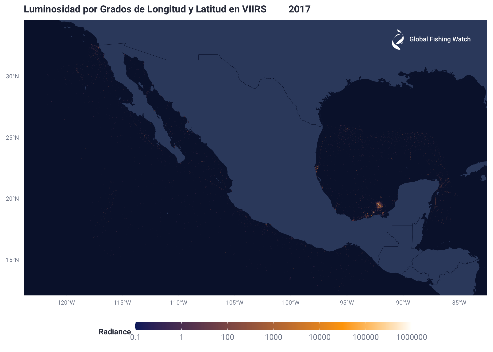

Esfuerzo Pesquero Datos VIIRS
================
Esteban Arenas
7/27/2020

Extract VMS fishing hours by 100th Lat Lon Bins while keeping Year and
Month

``` r
query_string <- glue::glue('
CREATE TEMP FUNCTION hours_diff_abs(timestamp1 TIMESTAMP,
timestamp2 TIMESTAMP) AS (
#
# Return the absolute value of the diff between the two timestamps in hours with microsecond precision
# If either parameter is null, return null
#
ABS(TIMESTAMP_DIFF(timestamp1,
    timestamp2,
    microsecond) / 3600000000.0) );

WITH 

pos AS (
select
  ssvid,
  msgid,
  seg_id,
  timestamp,
  # Change this to month or year if you want to aggregate differently
  EXTRACT(YEAR from timestamp) as year,
  EXTRACT(MONTH from timestamp) as month,
  LAG(timestamp, 1) OVER (PARTITION BY seg_id  ORDER BY timestamp) prev_timestamp,
  floor(lat * 100) as lat_bin,
  floor(lon * 100) as lon_bin,
  nnet_score
from `pipe_mexico_production_v20190912.messages_scored_*`
),

pos_hours AS (
SELECT
*,
IFNULL (hours_diff_abs (timestamp, prev_timestamp), 0) hours
FROM pos
),

# Summarize fishing
fishing AS (
SELECT
year,
month,
lat_bin / 100 as lat_bin,
lon_bin / 100 as lon_bin,
SUM(IF(nnet_score > 0.5, hours, 0)) as fishing_hours
FROM pos_hours
GROUP BY year, month, lat_bin, lon_bin
)

# Return
#Transform to hours/km2
SELECT *,
fishing_hours/(COS(udfs_v20200701.radians(lat_bin)) * (111/100)  * (111/100) ) AS fishing_hours_sq_km,
FROM fishing')
Mx_VMS_Esfuerzo_Pesquero100_Month <- DBI::dbGetQuery(con, query_string)
Mx_VMS_Esfuerzo_Pesquero100_Month$Log_fishing_hours_sq_km <- log10(Mx_VMS_Esfuerzo_Pesquero100_Month$fishing_hours_sq_km)
# write.csv(Mx_VMS_Esfuerzo_Pesquero100_Month, file = "Mx_VMS_Esfuerzo_Pesquero100_Month.csv")
```

Extract VIIRS data exclusively belonging to the Mexican EEZ

``` r
query_string <- glue::glue('
SELECT id, id_Key, Lat_DNB, Lon_DNB, Rad_DNB, Date_LTZ,
EXTRACT(DATE from Date_LTZ) as Date,
EXTRACT(YEAR from Date_LTZ) as Year,
EXTRACT(MONTH from Date_LTZ) as Month,
EXTRACT(DAY from Date_LTZ) as Day,
EEZ
FROM `pipe_viirs_production_v20180723.raw_vbd_global`
WHERE EEZ = "Mexican Exclusive Economic Zone"
')
VIIRS_MX <- DBI::dbGetQuery(con, query_string)
# write.csv(VIIRS_MX, file = "VIIRS_MX.csv")
```

Modify VIIRS database in order to compare with VMS database and remove
any entries found within VMS. This way resulting VIIRS data set will
only be of “dark targets” (vessels not transmitting a signal).
Additionally, will aggregate in order to graph by ascending luminosity
and unique IDs (number of vessels).

``` r
Mx_VMS_Esfuerzo_Pesquero100_Month <- read.csv ("/Users/Esteban/Documents/Jobs/GFW/Proyectos/Mexico/CN_Mexico/Datos/VIIRS/Mx_VMS_Esfuerzo_Pesquero100_Month.csv", header = TRUE)
VIIRS_MX <- read.csv ("/Users/Esteban/Documents/Jobs/GFW/Proyectos/Mexico/CN_Mexico/Datos/VIIRS/VIIRS_MX.csv", header = TRUE)

#Change column names in order to compare tables
colnames(Mx_VMS_Esfuerzo_Pesquero100_Month)[2] <- "Year"
colnames(Mx_VMS_Esfuerzo_Pesquero100_Month)[3] <- "Month"
colnames(Mx_VMS_Esfuerzo_Pesquero100_Month)[4] <- "LatBin"
colnames(Mx_VMS_Esfuerzo_Pesquero100_Month)[5] <- "LonBin"

#Add a counter to distinguish later between aggregated luminosity and aggregated total number of entries (vessels)
VIIRS_MX$Rows <- 1
#Group into 100th lat and lon bins to compare with VMS data
VIIRS_MX$LatBin <- (floor(VIIRS_MX$Lat_DNB * 100)/100)
VIIRS_MX$LonBin <- (floor(VIIRS_MX$Lon_DNB * 100)/100)

#Removing all entries from VIIRS_MX that share Year, Month, LatBin, and LonBin with VMS Mexico database
VIIRS_Not_VMS_F <- anti_join(VIIRS_MX, Mx_VMS_Esfuerzo_Pesquero100_Month, by=c("Year", "Month","LatBin", "LonBin"))
#Aggregating by rows taken as number of vessels per lat and lon bin
Rows_VIIRS_Not_VMS_F <- data.frame(aggregate(Rows ~ LatBin + LonBin+Year, VIIRS_Not_VMS_F, sum))
#Aggregating by luminosity per lat and lon bin
Lum_VIIRS_Not_VMS_F <- data.frame(aggregate(Rad_DNB ~ LatBin + LonBin+Year, VIIRS_Not_VMS_F, sum))
#Joining luminosity and rows (number of vessels) in one DB in order to graph
VIIRS_Graphing <- cbind(Lum_VIIRS_Not_VMS_F,Rows_VIIRS_Not_VMS_F$Rows)
colnames(VIIRS_Graphing)[4] <- "Radiance"
colnames(VIIRS_Graphing)[5] <- "Vessels"
VIIRS_Graphing$RadianceLog <- log10(VIIRS_Graphing$Radiance)
```

    ## Warning: NaNs produced

``` r
VIIRS_Graphing$VesselsLog <- log10(VIIRS_Graphing$Vessels)

#Selecting only years of interest in order to graph by year
Y2017_VIIRS <- VIIRS_Graphing[VIIRS_Graphing$Year == 2017,]
Y2018_VIIRS <- VIIRS_Graphing[VIIRS_Graphing$Year == 2018,]
Y2019_VIIRS <- VIIRS_Graphing[VIIRS_Graphing$Year == 2019,]
Y2020_VIIRS <- VIIRS_Graphing[VIIRS_Graphing$Year == 2020,]

# write.csv(Y2017_VIIRS, file = "Y2017_VIIRS.csv")
```

Only map luminosity because vessels didn’t show as well

``` r
# GFW logo
gfw_logo <- png::readPNG("/Users/Esteban/Documents/Jobs/GFW/General/Logo/GFW_logo_primary_White.png")
gfw_logo_rast <- grid::rasterGrob(gfw_logo, interpolate = T)

#Map
land_sf <- rnaturalearth::ne_countries(scale = 10, returnclass = 'sf')
VIIR_2017_R <- ggplot() + 
  geom_sf(data = land_sf,
            fill = fishwatchr::gfw_palettes$map_country_dark[1],
            color = fishwatchr::gfw_palettes$map_country_dark[2],
          size=.1) +
    scale_fill_gradientn(colours = c('#0c276c', '#764b5c', '#bb7644', '#ffa500','#ffffff'),
                         breaks = c(-1,0,1,2,3,4,5), labels = c('0.1','1','100','1000','10000','100000','1000000'),
                         limits = c(-1,5), oob=scales::squish)+
  fishwatchr::theme_gfw_map(theme = 'dark')+
  geom_tile(data = Y2017_VIIRS, aes(x = LonBin, y = LatBin, fill = RadianceLog), alpha = 0.5)+
  labs(fill = "Radiance", title = "Luminosidad por Grados de Longitud y Latitud en VIIRS         2017")+
  coord_sf(xlim = c(-121.9, -84.4), ylim = c(13.1, 33.6))+

  #Add GFW logo
  annotation_custom(gfw_logo_rast,
                      ymin = 32,
                      ymax = 34,
                      xmin = -91,
                      xmax = -84)
VIIR_2017_R
```

<!-- -->

``` r
# ggsave("VIIR_2017_R.png", dpi=300)
```

``` r
#Map
VIIR_2018_R <- ggplot() + 
  geom_sf(data = land_sf,
            fill = fishwatchr::gfw_palettes$map_country_dark[1],
            color = fishwatchr::gfw_palettes$map_country_dark[2],
          size=.1) +
    scale_fill_gradientn(colours = c('#0c276c', '#764b5c', '#bb7644', '#ffa500','#ffffff'),
                         breaks = c(-1,0,1,2,3,4,5), labels = c('0.1','1','100','1000','10000','100000','1000000'),
                         limits = c(-1,5), oob=scales::squish)+
  fishwatchr::theme_gfw_map(theme = 'dark')+
  geom_tile(data = Y2018_VIIRS, aes(x = LonBin, y = LatBin, fill = RadianceLog), alpha = 0.5)+
  labs(fill = "Radiance", title = "Luminosidad por Grados de Longitud y Latitud en VIIRS         2018")+
  coord_sf(xlim = c(-121.9, -84.4), ylim = c(13.1, 33.6))+

  #Add GFW logo
  annotation_custom(gfw_logo_rast,
                      ymin = 32,
                      ymax = 34,
                      xmin = -91,
                      xmax = -84)
VIIR_2018_R
```

<!-- -->

``` r
# ggsave("VIIR_2018_R.png", dpi=300)
```

``` r
#Map
VIIR_2019_R <- ggplot() + 
  geom_sf(data = land_sf,
            fill = fishwatchr::gfw_palettes$map_country_dark[1],
            color = fishwatchr::gfw_palettes$map_country_dark[2],
          size=.1) +
    scale_fill_gradientn(colours = c('#0c276c', '#764b5c', '#bb7644', '#ffa500','#ffffff'),
                         breaks = c(-1,0,1,2,3,4,5), labels = c('0.1','1','100','1000','10000','100000','1000000'),
                         limits = c(-1,5), oob=scales::squish)+
  fishwatchr::theme_gfw_map(theme = 'dark')+
  geom_tile(data = Y2019_VIIRS, aes(x = LonBin, y = LatBin, fill = RadianceLog), alpha = 0.5)+
  labs(fill = "Radiance", title = "Luminosidad por Grados de Longitud y Latitud en VIIRS         2019")+
  coord_sf(xlim = c(-121.9, -84.4), ylim = c(13.1, 33.6))+

  #Add GFW logo
  annotation_custom(gfw_logo_rast,
                      ymin = 32,
                      ymax = 34,
                      xmin = -91,
                      xmax = -84)
VIIR_2019_R
```

<!-- -->

``` r
# ggsave("VIIR_2019_R.png", dpi=300)
```

``` r
#Map
VIIR_2020_R <- ggplot() + 
  geom_sf(data = land_sf,
            fill = fishwatchr::gfw_palettes$map_country_dark[1],
            color = fishwatchr::gfw_palettes$map_country_dark[2],
          size=.1) +
    scale_fill_gradientn(colours = c('#0c276c', '#764b5c', '#bb7644', '#ffa500','#ffffff'),
                         breaks = c(-1,0,1,2,3,4,5), labels = c('0.1','1','100','1000','10000','100000','1000000'),
                         limits = c(-1,5), oob=scales::squish)+
  fishwatchr::theme_gfw_map(theme = 'dark')+
  geom_tile(data = Y2020_VIIRS, aes(x = LonBin, y = LatBin, fill = RadianceLog), alpha = 0.5)+
  labs(fill = "Radiance", title = "Luminosidad por Grados de Longitud y Latitud en VIIRS         2020")+
  coord_sf(xlim = c(-121.9, -84.4), ylim = c(13.1, 33.6))+

  #Add GFW logo
  annotation_custom(gfw_logo_rast,
                      ymin = 32,
                      ymax = 34,
                      xmin = -91,
                      xmax = -84)
VIIR_2020_R
```

<!-- -->

``` r
# ggsave("VIIR_2020_R.png", dpi=300)
```

``` r
#GIF from the images of the maps
png_files <- list.files("/Users/Esteban/Documents/Jobs/GFW/Proyectos/Mexico/CN_Mexico/Datos/VIIRS",
                        pattern = ".*png$", full.names = TRUE)
gifski(png_files, gif_file = "VIIR_2017_2020_R.gif", width = 2100, height = 2100, delay = 1)
```
